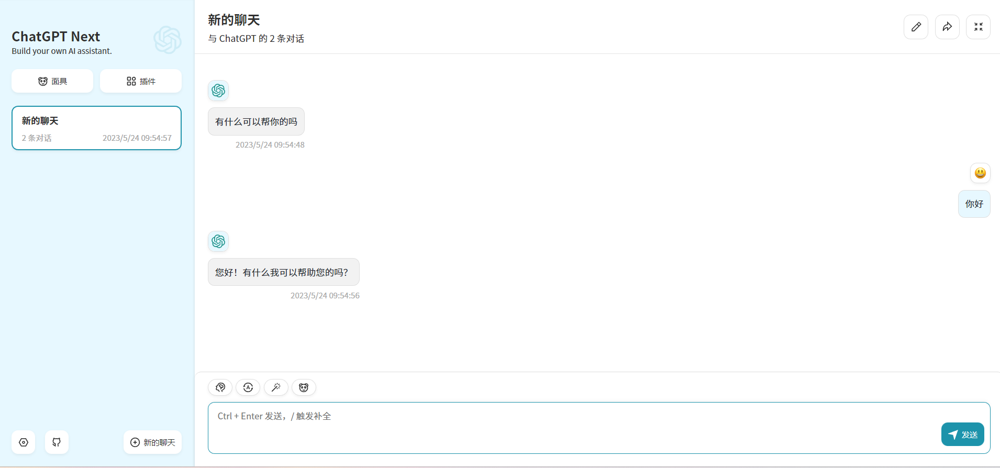
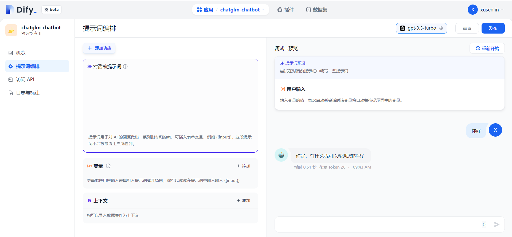

# API for Open LLMs

<p align="center">
    <a href="https://github.com/xusenlinzy/api-for-open-llm"></a>
    <a href=""></a>
    <a href=""></a>
    <a href="https://github.com/xusenlinzy/api-for-open-llm"></a>
    <a href="https://github.com/xusenlinzy/api-for-open-llm"></a>
    <a href="https://github.com/xusenlinzy/api-for-open-llm"></a>
    <a href="https://github.com/xusenlinzy/api-for-open-llm"></a>
</p>


<div align="center"> 图片来自于论文: [A Survey of Large Language Models](https://arxiv.org/pdf/2303.18223.pdf) </div>


## 📢 News


+ 【2023.07.15】 支持 [starchat](https://huggingface.co/HuggingFaceH4/starchat-beta) 模型，启动方式见 [starchat](https://github.com/xusenlinzy/api-for-open-llm/blob/master/SCRIPT.md#starchat)


+ 【2023.07.14】 支持在一个 **`API BASE`** 下调用多个模型
   + ① 根据 [SCRIPT](./SCRIPT.md) 启动多个模型
   + ② 修改 [chatgpt](./chatgpt.py) 中的 **`MODEL_LIST`**，将启动的模型加入进去
   + ③ **`python chatgpt.py`**


+ 【2023.07.12】 支持 [baichuan-13b-chat](https://github.com/baichuan-inc/Baichuan-13B) 模型，启动方式见 [baichuan-13b-chat](https://github.com/xusenlinzy/api-for-open-llm/blob/master/SCRIPT.md#baichuan-13b-chat)


+ 【2023.07.07】 支持 [InternLM](https://github.com/InternLM/InternLM) 模型，启动方式见 [internlm-chat-7b](https://github.com/xusenlinzy/api-for-open-llm/blob/master/SCRIPT.md#internlm)


+ 【2023.06.26】 支持 [ChatGLM2-6b](https://github.com/THUDM/ChatGLM2-6B) 模型


+ 【2023.06.12】 使用 [m3e](https://huggingface.co/moka-ai/m3e-base) 中文嵌入模型（在中文文本分类和文本检索上都优于 `openai-ada-002`）


---

**主要特性**：

此项目为开源大模型的推理实现统一的后端接口，与 `OpenAI` 的响应保持一致，具有以下特性：

+ ✨ 以 `OpenAI ChatGPT API` 的方式调用各类开源大模型


+ 🖨️ 支持流式响应，实现打印机效果


+ 📖 实现文本嵌入模型，为文档知识问答提供支持


+ 🦜️ 支持大规模语言模型开发工具 [`langchain` ](https://github.com/hwchase17/langchain) 的各类功能
 

+ 🙌 只需要简单的修改环境变量即可将开源模型作为 `chatgpt` 的替代模型，为各类应用提供后端支持


+ 🚀 支持加载经过自行训练过的 `lora` 模型


## 🐼 模型

支持多种开源大模型

| Model                                                                 |   Backbone   | #Params  | Claimed language |                                               checkpoint link                                               |
|:----------------------------------------------------------------------|:------------:|:--------:|:----------------:|:-----------------------------------------------------------------------------------------------------------:|
| [baichuan-13b-chat](https://github.com/baichuan-inc/Baichuan-13B)     |   Baichuan   |   13B    |      en, zh      |           [baichuan-inc/Baichuan-13B-Chat](https://huggingface.co/baichuan-inc/Baichuan-13B-Chat)           |
| [InternLM](https://github.com/InternLM/InternLM)                      |   InternLM   |    7B    |      en, zh      |                [internlm/internlm-chat-7b](https://huggingface.co/internlm/internlm-chat-7b)                |
| [ChatGLM2](https://github.com/THUDM/ChatGLM2-6B)                      |     GLM      |  6/130B  |      en, zh      |                        [THUDM/chatglm2-6b](https://huggingface.co/THUDM/chatglm2-6b)                        |
| [baichaun-7b](https://github.com/baichuan-inc/baichuan-7B)            |   Baichuan   |    7B    |      en, zh      |                 [baichuan-inc/baichuan-7B](https://huggingface.co/baichuan-inc/baichuan-7B)                 |
| [Guanaco](https://github.com/artidoro/qlora/tree/main)                |    LLaMA     | 7/33/65B |        en        |           [timdettmers/guanaco-33b-merged](https://huggingface.co/timdettmers/guanaco-33b-merged)           |
| [YuLan-Chat](https://github.com/RUC-GSAI/YuLan-Chat)                  |    LLaMA     |  13/65B  |      en, zh      |            [RUCAIBox/YuLan-Chat-13b-delta](https://huggingface.co/RUCAIBox/YuLan-Chat-13b-delta)            |
| [TigerBot](https://github.com/TigerResearch/TigerBot)                 |    BLOOMZ    |  7/180B  |      en, zh      |            [TigerResearch/tigerbot-7b-sft](https://huggingface.co/TigerResearch/tigerbot-7b-sft)            |
| [OpenBuddy](https://github.com/OpenBuddy/OpenBuddy)                   | LLaMA、Falcon |    7B    |      multi       |                                [OpenBuddy](https://huggingface.co/OpenBuddy)                                |
| [MOSS](https://github.com/OpenLMLab/MOSS)                             |   CodeGen    |   16B    |      en, zh      |              [fnlp/moss-moon-003-sft-int4](https://huggingface.co/fnlp/moss-moon-003-sft-int4)              |
| [Phoenix](https://github.com/FreedomIntelligence/LLMZoo)              |    BLOOMZ    |    7B    |      multi       | [FreedomIntelligence/phoenix-inst-chat-7b](https://huggingface.co/FreedomIntelligence/phoenix-inst-chat-7b) |
| [BAIZE](https://github.com/project-baize/baize-chatbot)               |    LLaMA     | 7/13/30B |        en        |              [project-baize/baize-lora-7B](https://huggingface.co/project-baize/baize-lora-7B)              |
| [Chinese-LLaMA-Alpaca](https://github.com/ymcui/Chinese-LLaMA-Alpaca) |    LLaMA     |  7/13B   |      en, zh      |   [ziqingyang/chinese-alpaca-plus-lora-7b](https://huggingface.co/ziqingyang/chinese-alpaca-plus-lora-7b)   |
| [BELLE](https://github.com/LianjiaTech/BELLE)                         |    BLOOMZ    |    7B    |        zh        |                   [BelleGroup/BELLE-7B-2M](https://huggingface.co/BelleGroup/BELLE-7B-2M)                   |
| [ChatGLM](https://github.com/THUDM/ChatGLM-6B)                        |     GLM      |    6B    |      en, zh      |                         [THUDM/chatglm-6b](https://huggingface.co/THUDM/chatglm-6b)                         |


## 🐳 环境配置

### docker启动（**推荐**）

构建镜像

```shell
docker build -t llm-api:pytorch .
```

启动容器

```shell
docker run -it -d --gpus all --ipc=host --net=host -p 80:80 --name=chatglm \
    --ulimit memlock=-1 --ulimit stack=67108864 \
    -v `pwd`:/workspace \
    llm-api:pytorch \
    python api/app.py \
    --port 80 \
    --allow-credentials \
    --model_name chatglm \
    --model_path THUDM/chatglm-6b \
    --embedding_name moka-ai/m3e-base
```

主要参数含义：

+ `model_name`: 模型名称，如`chatglm`、`phoenix`、`moss`等

+ `model_path`: 开源大模型的文件所在路径

+ `embedding_name`（可选项）: 嵌入模型的文件所在路径

更多模型的启动命令详见 [SCRIPT.md](./SCRIPT.md)

### 本地启动

安装 `pytorch` 环境

```shell
conda create -n pytorch python=3.8
conda activate pytorch
conda install pytorch cudatoolkit -c pytorch
```

安装依赖包

```shell
pip install -r requirements.txt
```

启动后端

```shell
python api/app.py \
    --port 80 \
    --allow-credentials \
    --model_path THUDM/chatglm-6b \
    --embedding_name GanymedeNil/text2vec-large-chinese
```


## 🤖 使用方式

### 环境变量

+ `OPENAI_API_KEY`: 此处随意填一个字符串即可

+ `OPENAI_API_BASE`: 后端启动的接口地址，如：http://192.168.0.xx:80/v1

### [聊天界面](./applications)

```shell
cd applications

python web_demo.py
```


### [openai-python](https://github.com/openai/openai-python)

<details>
<summary>👉 Chat Completions</summary>

```python
import openai

openai.api_base = "http://192.168.0.xx:80/v1"

# Enter any non-empty API key to pass the client library's check.
openai.api_key = "xxx"

# Enter any non-empty model name to pass the client library's check.
completion = openai.ChatCompletion.create(
    model="chatglm-6b",
    messages=[
        {"role": "user", "content": "你好"},
    ],
    stream=False,
)

print(completion.choices[0].message.content)
# 你好👋！我是人工智能助手 ChatGLM-6B，很高兴见到你，欢迎问我任何问题。
```

</details>

<details>
<summary>👉 Completions</summary>

```python
import openai

openai.api_base = "http://192.168.0.xx:80/v1"

# Enter any non-empty API key to pass the client library's check.
openai.api_key = "xxx"

# Enter any non-empty model name to pass the client library's check.
completion = openai.Completion.create(prompt="你好", model="chatglm-6b")

print(completion.choices[0].text)
# 你好👋！我是人工智能助手 ChatGLM-6B，很高兴见到你，欢迎问我任何问题。
```

</details>

<details>
<summary>👉 Embeddings</summary>

```python
import openai

openai.api_base = "http://192.168.0.xx:80/v1"

# Enter any non-empty API key to pass the client library's check.
openai.api_key = "xxx"

# compute the embedding of the text
embedding = openai.Embedding.create(
    input="什么是chatgpt？", 
    model="text2vec-large-chinese"
)

print(embedding['data'][0]['embedding'])
```

</details>

### [langchain](https://github.com/hwchase17/langchain)

<details>
<summary>👉 Chat Completions</summary>

```python
import os

os.environ["OPENAI_API_BASE"] = "http://192.168.0.xx:80/v1"
os.environ["OPENAI_API_KEY"] = "xxx"

from langchain.chat_models import ChatOpenAI
from langchain.schema import HumanMessage

chat = ChatOpenAI()
print(chat([HumanMessage(content="你好")]))
# content='你好👋！我是人工智能助手 ChatGLM-6B，很高兴见到你，欢迎问我任何问题。' additional_kwargs={}
```
</details>

<details>
<summary>👉 Completions</summary>

```python
import os

os.environ["OPENAI_API_BASE"] = "http://192.168.0.xx:80/v1"
os.environ["OPENAI_API_KEY"] = "xxx"

from langchain.llms import OpenAI

llm = OpenAI()
print(llm("你好"))
# 你好👋！我是人工智能助手 ChatGLM-6B，很高兴见到你，欢迎问我任何问题。
```

</details>

<details>
<summary>👉 Embeddings</summary>

```python
import os

os.environ["OPENAI_API_BASE"] = "http://192.168.0.xx:80/v1"
os.environ["OPENAI_API_KEY"] = "xxx"

from langchain.embeddings import OpenAIEmbeddings

embeddings = OpenAIEmbeddings()
query_result = embeddings.embed_query("什么是chatgpt？")
print(query_result)
```
</details>

### 可接入的项目

**通过修改上面的 `OPENAI_API_BASE` 环境变量，大部分的 `chatgpt` 应用和前后端项目都可以无缝衔接！**

+ [ChatGPT-Next-Web: One-Click to deploy well-designed ChatGPT web UI on Vercel](https://github.com/Yidadaa/ChatGPT-Next-Web)

```shell
docker run -d -p 3000:3000 \
   -e OPENAI_API_KEY="sk-xxxx" \
   -e BASE_URL="http://192.168.0.xx:80" \
   yidadaa/chatgpt-next-web
```



+ [dify: An easy-to-use LLMOps platform designed to empower more people to create sustainable, AI-native applications](https://github.com/langgenius/dify)

```shell
# 在docker-compose.yml中的api和worker服务中添加以下环境变量
OPENAI_API_BASE: http://192.168.0.xx:80/v1
DISABLE_PROVIDER_CONFIG_VALIDATION: 'true'
```




## 📜 License

此项目为 `Apache 2.0` 许可证授权，有关详细信息，请参阅 [LICENSE](LICENSE) 文件。


## 🚧 References

+ [ChatGLM: An Open Bilingual Dialogue Language Model](https://github.com/THUDM/ChatGLM-6B)

+ [BLOOM: A 176B-Parameter Open-Access Multilingual Language Model](https://arxiv.org/abs/2211.05100)

+ [LLaMA: Open and Efficient Foundation Language Models](https://arxiv.org/abs/2302.13971v1)

+ [Efficient and Effective Text Encoding for Chinese LLaMA and Alpaca](https://github.com/ymcui/Chinese-LLaMA-Alpaca)

+ [Phoenix: Democratizing ChatGPT across Languages](https://github.com/FreedomIntelligence/LLMZoo)

+ [MOSS: An open-sourced plugin-augmented conversational language model](https://github.com/OpenLMLab/MOSS)

+ [FastChat: An open platform for training, serving, and evaluating large language model based chatbots](https://github.com/lm-sys/FastChat)

+ [LangChain: Building applications with LLMs through composability](https://github.com/hwchase17/langchain)

+ [ChuanhuChatgpt](https://github.com/GaiZhenbiao/ChuanhuChatGPT)
